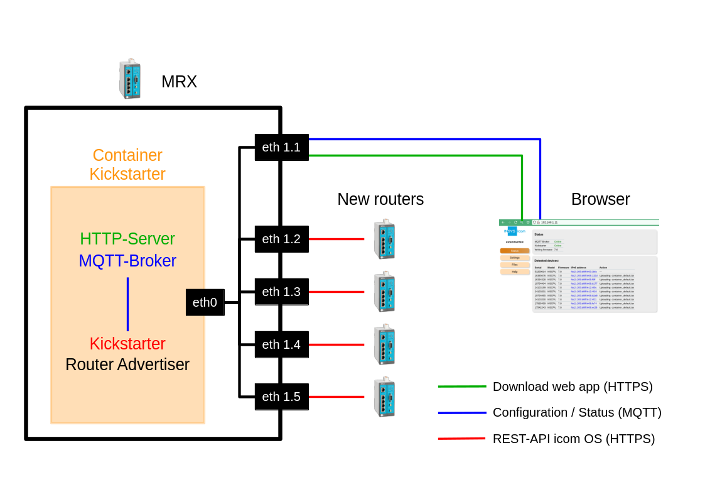
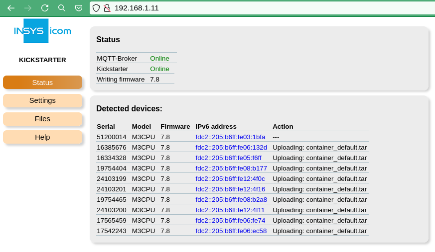
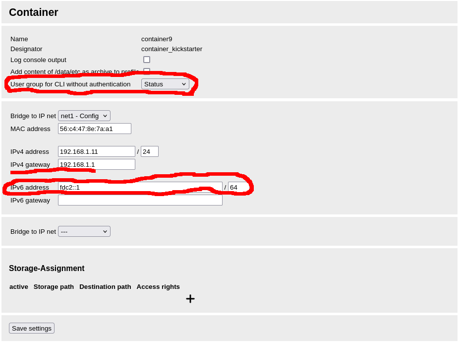

# Kickstarter
Set up [INSYS icom devices](https://www.insys-icom.com/en/products/router-gateways/) completely autonomously and in parallel!

**Kickstarter** is a container that runs on an INSYS icom device, such as the MRX. It automates the setup of your INSYS icom devices by:
- Updating the [**icom OS firmware**](https://icom-os.releasenotes.io/)
- Uploading **configurations** (ASCII, binary profiles), containers, licenses, etc.
- Applying device-specific **individual settings**
- Registering devices at [**iRM** (icom Router Management)](https://cloud.insys-icom.com)

It can update devices in parallel! That saves a huge amount of time when setting up a whole bunch of new devices.   

## UserInterface
Kickstarter has a web UI for its configuration and to visualize its progress with the devices:

## Documentation
Look at its [documentation](closed_packages/kickstarter/web/help), what it can do.  
In case you miss a functionality or find a bug, please do not hesitate to open up an issue!

## Configuraton of the MRX running the Kickstarter container
This are settings to be entered at the **MRX that runs** Kickstarter.
Kickstarter uses IPv6 to communicate with new devices.
You have to configure the IPv6 address **fdc2::1/64** on the first Ethernet interface of the Kickstarter container.
It also need at least "Status" access right for the containers CLI access: Select at least "Status" at "User group for CLI without authentication" at the container config.
Kickstarter can optionally check for the latest released firmware and download download it on its own.
If it should do that, it needs internet access, so you have to configure a gateway.

## Building the container from scratch
Kickstarter is a project derived from [m3-container.net](https://m3-container.net/). 
Its github [repo](https://github.com/insys-icom/M3_Container) describes in detail, how to build this container.
In short:
- install the SDK
- clone this repo
- start the SDK with the directory with this repo mounted
- run the script, that builds everything from the projects directory: "./scripts/create_container_kickstarter.sh"

The final image will be stored in "./images".
  
