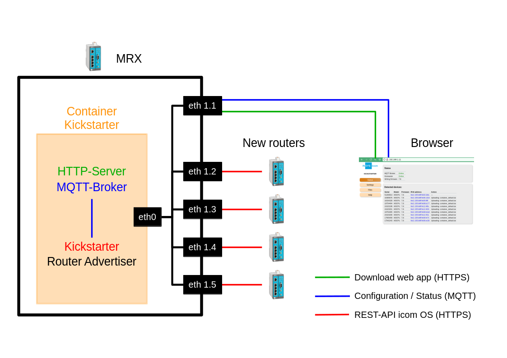
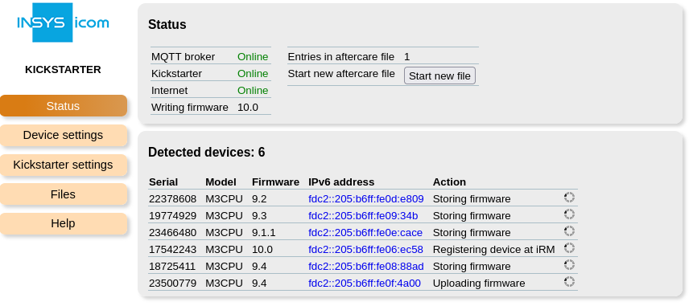
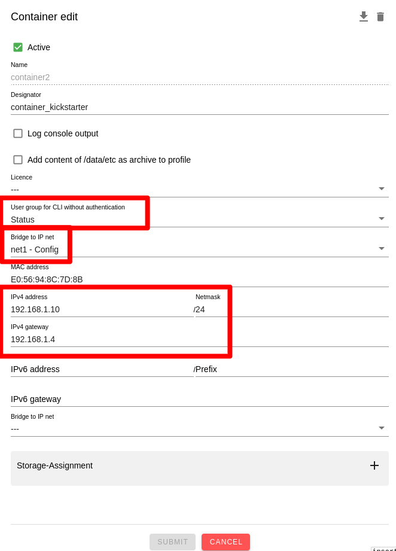
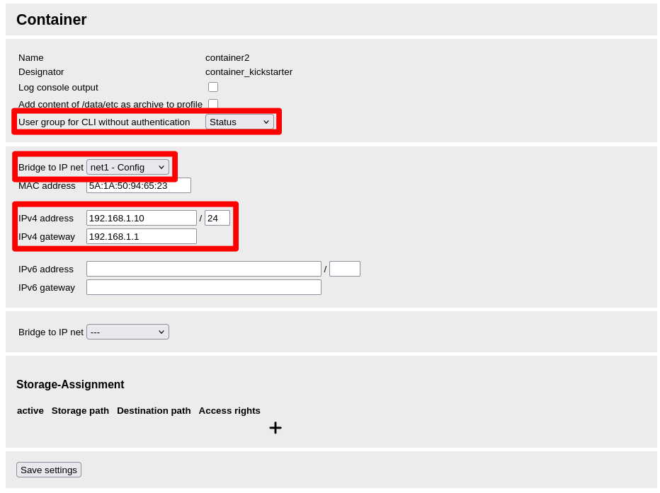

# Kickstarter
Set up fresh [INSYS icom devices](https://www.insys-icom.com/en/products/router-gateways/) out of the box completely autonomously and in parallel!

**Kickstarter** is a container that runs on an INSYS icom device, such as the MRX. It automates the setup of your INSYS icom devices by:
- Updating the [**icom OS firmware**](https://icom-os.releasenotes.io/)
- Uploading **configurations** (ASCII, binary profiles), containers, licenses, etc.
- Applying device-specific **individual settings**
- Registering devices at [**iRM** (icom Router Management)](https://cloud.insys-icom.com)

It can update several devices in parallel! That saves a huge amount of time when setting up a whole bunch of new devices.

## UserInterface
Kickstarter has a web UI for its configuration and to visualize its progress with the devices:

## Documentation
Look at its [documentation](closed_packages/kickstarter/web/help), what it can do.
In case you miss a functionality or find a bug, please do not hesitate to open up an issue!

## Configuraton of the MRX running the Kickstarter container
These settings are needed on the **MRX that runs** that runs the Kickstarter container:
- set "User group for CLI without authentication" to at least "Status"
- set an IP address, so you can access Kickstarters web UI
- set a gateway, most likely the IP address of the MRX, that runs the container

Kickstarter uses the Internet for downloading the latest firmware images.

MRX config in new UI:

MRX config in classic UI:

## Building the container from scratch
Kickstarter is a project derived from [m3-container.net](https://m3-container.net/).
Its github [repo](https://github.com/insys-icom/M3_Container) describes in detail, how to build this container.
In short:
- install the SDK
- clone this repo
- start the SDK with the directory with this repo mounted
- run the script, that builds everything from the projects directory: "./scripts/create_container_kickstarter.sh"

The final image will be stored in "./images".
